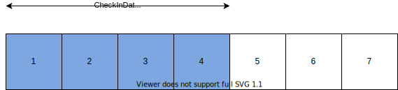
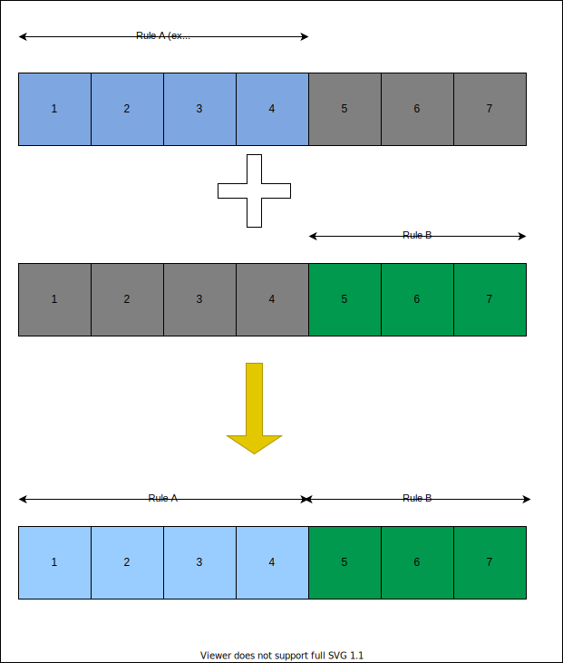
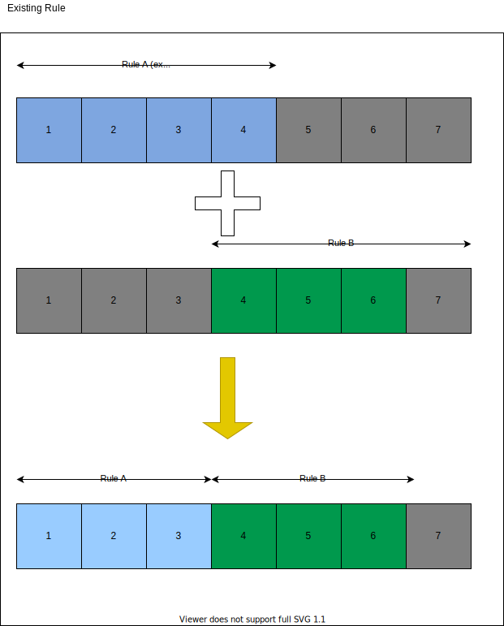

This operation allows the user to setting up a price strategy based on length of stay.

## Use Cases
### Setting up a new length of stay price rule


Block 1-7 indicate unique identifier that follows this rule
- 2022-01-X where x is date number
- same roomTypeId, propertyId, occupancy

your request will look like this

Rule A request
```json
{
  "propertyId": 5,
  "currency": "USD",
  "offers": [
    {
      "roomId": 5,
      "ratePlanId": 5,
      "rates": [
        {
          "checkIn": {
            "start": "2022-01-01",
            "end": "2022-01-04"
          },
          "occupancyPrices": [
            {
              "occupancy": {
                "min": 1,
                "max": 1
              },
              "prices": [
                {
                  "los": 1,
                  "value": 6200.00
                },
                {
                  "los": 2,
                  "value": 6000.00
                },
                {
                  "los": 3,
                  "value": 5500.00
                },
                {
                  "los": 4,
                  "value": 5000.00
                }
              ]
            }
          ]
      }
      ]
    }
  ]
}
```
each blog indicate a set of uniqe identifier

when you made a request, the api will store information in Agoda system, and you can retrived the current setup via https://supply.agoda.com/api/price/fplos/search
you will get the price setup like this

### Updating a lenght of stay rule


From the figure above, if you wanted to change your policy, you may made a request that look like this

Rule B request
```json
{
  "propertyId": 5,
  "currency": "USD",
  "offers": [
    {
      "roomId": 5,
      "ratePlanId": 5,
      "rates": [
        {
          "checkIn": {
            "start": "2022-01-05",
            "end": "2022-01-07"
          },
          "occupancyPrices": [
            {
              "occupancy": {
                "min": 1,
                "max": 1
              },
              "prices": [
                {
                  "los": 1,
                  "value": 10200.00
                },
                {
                  "los": 2,
                  "value": 10000.00
                },
                {
                  "los": 3,
                  "value": 9000.00
                }
              ]
            }
          ]
      }
      ]
    }
  ]
}
```



when you made a request, any booking date that made in 4-6 will use rule B instead of A ( for instance,. if traveller book for a property with 1 date lenght of stay, they will get a rate of USD 10200.00 )

### Overlapping rule
Given you got a situation where you want to update the price with same identifier ( in this document, I means that it got same roomTypeId, propertyId and occupancy)

The last rule will take priority, please check the scenario below



Given that Rule B looks like this
```json
{
  "propertyId": 5,
  "currency": "USD",
  "offers": [
    {
      "roomId": 5,
      "ratePlanId": 5,
      "rates": [
        {
          "checkIn": {
            "start": "2022-01-04",
            "end": "2022-01-07"
          },
          "occupancyPrices": [
            {
              "occupancy": {
                "min": 1,
                "max": 1
              },
              "prices": [
                {
                  "los": 1,
                  "value": 10200.00
                },
                {
                  "los": 2,
                  "value": 10000.00
                },
                {
                  "los": 3,
                  "value": 9000.00
                }
              ]
            }
          ]
      }
      ]
    }
  ]
}
```

then the booking that happened after 4 January 2022 to 6 January 2022 will use 10200, 10000, 9000 as a rate depends on length of stay, instead of 6200, 6000, 5500, 5000


### Updating Rates
For current version, LOS rates can be partial update with the max los rate for each occupancyPrices pass everytime. In order to add, update, or switch it off, it can be done partially with previous limitation. Changing value of each los value to 0, it will switch that los rate off. For example, after the request B was successfully sent, if los 2 needs to be turned off. It can be done partially by below request.

```json
{
  "propertyId": 5,
  "currency": "USD",
  "offers": [
    {
      "roomId": 5,
      "ratePlanId": 5,
      "rates": [
        {
          "checkIn": {
            "start": "2022-01-04",
            "end": "2022-01-07"
          },
          "occupancyPrices": [
            {
              "occupancy": {
                "min": 1,
                "max": 1
              },
              "prices": [
                {
                  "los": 2,
                  "value": 0
                },
                {
                  "los": 3,
                  "value": 9000.00
                }
              ]
            }
          ],
          "restriction": {
              "closed": false,
              "cta": false,
              "ctd": true,
              "minStay": 1,
              "maxStay": 10,
              "minStayThrough": 5,
              "minAdvPurchase": 1,
              "maxAdvPurchase": 20,
              "losRestriction": "111" // open for LOS 1,2,3
          }
        }
      ]
    }
  ]
}
```
This request will only update for los 2, and 3 and 1 will remain the same.
For the check-date of 2022-01-04 and check-out of 2022-01-06 (los 2), this will not be available in the storefront as it was already turned off.

losRestriction in restriction is required for every partial update, to keep the los rate open.

Blocking rates can be done by updating value to be 0 or changing each digit in losRestriction field. For example, 111 means open for LOS 1 to 3. 110 means open for LOS 1 to 2.


### Limitation
Currently we have several limitations with the losRestriction field in restrictions. First, losRestriction range need to be the same as the max los of each request. Second, it need to be passed everytime in order to keep the rates open.


```json
{
	"propertyId": 5,
	"currency": "THB",
	"offers": [
		{
			"roomId": 123,
			"ratePlanId": 123,
			"rates": [
				{
					"checkIn": {
						"start": "2023-01-10",
						"end": "2023-01-10"
					},
					"occupancyPrices": [
						{
							"occupancy": {
								"min": 1,
								"max": 5
							},
							"prices": [
								{
									"los": 5,
									"value": 1000
								},
								{
									"los": 6,
									"value": 1200
								},
								{
									"los": 6,
									"value": 1400
								},
								{
									"los": 10,
									"value": 2000
								},
								{
									"los": 15,
									"value": 0
								}
							]
						}
					]
				},
				{
					"checkIn": {
						"start": "2023-01-11",
						"end": "2023-01-11"
					},
					"occupancyPrices": [
						{
							"occupancy": {
								"min": 1,
								"max": 5
							},
							"prices": [
								{
									"los": 5,
									"value": 1000
								},
								{
									"los": 6,
									"value": 1200
								},
								{
									"los": 6,
									"value": 1400
								},
								{
									"los": 15,
									"value": 3000
								}
							]
						}
					]
				}
				
			],
        "restrictions": [
        {
          "startDate": "2023-01-02",
          "endDate": "2023-01-11",
          "closed": false,
          "cta": false,
          "ctd": true,
          "minStay": 1,
          "maxStay": 10,
          "minStayThrough": 5,
          "minAdvPurchase": 1,
          "maxAdvPurchase": 20,
          "losRestriction": "111111111111111"
        },
        {
          "startDate": "2022-07-01",
          "endDate": "2022-07-10",
          "closed": false,
          "cta": false,
          "ctd": true,
          "minStay": 1,
          "maxStay": 10,
          "minStayThrough": 5,
          "minAdvPurchase": 1,
          "maxAdvPurchase": 20,
          "losRestriction": "111111111111110"
        }
      ]
		}
	]
}
```
From request above, here is the result
```json
{
    "propertyId": 5,
    "roomId": 123,
    "ratePlanId": 123,
    "rates": [
        {
            "checkInDate": "2023-01-10",
            "rate": {
                "currency": "THB",
                "prices": [
                    {
                        "los": 5,
                        "value": 1000,
                        "occupancy": {
                            "min": 1,
                            "max": 5
                        }
                    },
                    {
                        "los": 6,
                        "value": 1400,
                        "occupancy": {
                            "min": 1,
                            "max": 5
                        }
                    },
                    {
                        "los": 10,
                        "value": 2000,
                        "occupancy": {
                            "min": 1,
                            "max": 5
                        }
                    }
                ]
            },
            "restriction": {
                "closed": false,
                "cta": false,
                "ctd": true,
                "minStay": 1,
                "maxStay": 10,
                "minStayThrough": 5,
                "minAdvPurchase": 1,
                "maxAdvPurchase": 20,
                "losRestriction": "111111111111111"
            }
        },
        {
            "checkInDate": "2023-01-11",
            "rate": {
                "currency": "THB",
                "prices": [
                    {
                        "los": 5,
                        "value": 1000,
                        "occupancy": {
                            "min": 1,
                            "max": 5
                        }
                    },
                    {
                        "los": 6,
                        "value": 1400,
                        "occupancy": {
                            "min": 1,
                            "max": 5
                        }
                    }
                ]
            },
            "restriction": {
                "closed": false,
                "cta": false,
                "ctd": true,
                "minStay": 1,
                "maxStay": 10,
                "minStayThrough": 5,
                "minAdvPurchase": 1,
                "maxAdvPurchase": 20,
                "losRestriction": "111111111111111"
            }
        }
    ]
}
```
